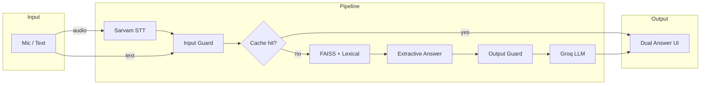

<div align="center">

# Voice RAG App

**Hindi–English voice & text Q&A over MSMARCO passages — fast extractive answers with optional Groq polish.**

[](https://www.python.org/)
[](https://fastapi.tiangolo.com/)
[](https://github.com/facebookresearch/faiss)
[](#)

[Quick Start](#-quick-start) · [Features](#-features) · [API](#-api-reference) · [Architecture](#-architecture) · [Latency](#-latency--benchmarks)

</div>

---

## Overview

Voice RAG is a **single FastAPI application** that serves both the web UI and the retrieval API on the same origin — no separate frontend build step.

| Path | What it does |
|------|----------------|
| **Voice** | Mic → Sarvam STT → hybrid FAISS retrieve → extractive answer → optional Groq LLM |
| **Text** | Same pipeline without STT — ideal for debugging and benchmarks |
| **Stream** | NDJSON stream: extractive first, then LLM tokens as they arrive |

The **200 ms target** applies to the **extractive path** (`latency_ms`). Groq generation is tracked separately as `generate_ms` and does not count toward that SLA.

---

## Features

<table>
<tr>
<td width="50%" valign="top">

### Retrieval
- **Hybrid search** — dense FAISS + lexical rerank
- **GPU-aware embeddings** via `EMBED_DEVICE=auto|cuda|cpu`
- Prebuilt index under `indexes/` (~290k chunks, HI + EN)
- Model: `sentence-transformers/all-MiniLM-L6-v2`

</td>
<td width="50%" valign="top">

### Answers
- **Extractive** — instant, grounded answers from passages
- **LLM card** — Groq `allam-2-7b` polish on same chunks
- Input / output guardrails with grounding checks
- **Query cache** — MD5 LRU exact-match (512 entries)

</td>
</tr>
<tr>
<td width="50%" valign="top">

### UI pages
- **`/`** — main voice + text demo
- **`/sample-question`** — curated sample queries
- **`/latency-report`** — P50 / P70 / P100 dashboard

</td>
<td width="50%" valign="top">

### Ops
- `GET /health` — model, device, chunk count, cache stats
- CLI bench: `app/latency_bench.py`
- One-time index builder in `one-time/create_vector_database/`

</td>
</tr>
</table>

---

## Architecture



<details>
<summary><strong>Step-by-step pipeline</strong></summary>

1. **STT** (voice only) — audio uploaded to Sarvam; timing in `stt_ms`
2. **Input guard** — safety / off-topic checks
3. **Query cache** — normalized exact match skips retrieve + LLM
4. **Retrieve** — embed query → FAISS top-k → lexical rerank → `retrieve_ms`
5. **Extractive** — sentence pick from passages; `latency_ms` = retrieve + extractive + guards
6. **LLM** (optional) — Groq on top-2 chunks; `generate_ms` tracked separately
7. **Output guard** — token overlap; falls back to extractive if ungrounded

</details>

---

## Quick Start

### Prerequisites

- Python **3.11+**
- Prebuilt index files in `indexes/` (`chunks.json`, `index.faiss`, `index_meta.json`)
- API keys: **Sarvam** (STT), **Groq** (optional LLM)

### 1. Clone & install

```powershell
cd project2
python -m venv .venv
.\.venv\Scripts\Activate.ps1
pip install -r requirements.txt
```

### 2. Configure environment

Copy the example file and fill in your keys:

```powershell
copy .env.example .env
```

```env
# Speech-to-text (Sarvam)
SARVAM_API_KEY=your_key
SARVAM_STT_URL=https://your-sarvam-stt-endpoint

# LLM polish (Groq)
GROQ_API_KEY=your_key
GROQ_MODEL=allam-2-7b
LLM_FALLBACK=1

# Performance
EMBED_DEVICE=auto
QUERY_CACHE=1
QUERY_CACHE_MAX=512
```

> **Note:** Never commit `.env`. It is listed in `.gitignore`.

### 3. Run the server

```powershell
python -m uvicorn app.main:app --host 0.0.0.0 --port 8000
```

| Page | URL |
|------|-----|
| Main app | http://127.0.0.1:8000 |
| Sample questions | http://127.0.0.1:8000/sample-question |
| Latency dashboard | http://127.0.0.1:8000/latency-report |
| Health check | http://127.0.0.1:8000/health |

---

## API Reference

### Endpoints

| Method | Route | Description |
|--------|-------|-------------|
| `GET` | `/` | Web UI |
| `GET` | `/health` | Status, embedding model, cache stats |
| `POST` | `/ask` | Voice query — `multipart/form-data` audio file |
| `POST` | `/ask-text` | Text query — JSON `{ "question": "..." }` |
| `POST` | `/ask-text-stream` | Streaming NDJSON (extractive → LLM deltas) |
| `GET` | `/api/sample-questions` | Sample questions from index (`?limit=18`) |
| `GET` | `/api/latency-report` | Cached latency report (`?max_queries=100`) |
| `POST` | `/api/latency-report/recalculate` | Force fresh benchmark run |

### Response fields

| Field | Meaning |
|-------|---------|
| `answer` | Primary answer shown in UI |
| `extractive` | Extractive card payload |
| `llm` | Groq card payload (if enabled) |
| `stt_ms` | Sarvam transcription time |
| `retrieve_ms` | Embedding + FAISS + rerank |
| `latency_ms` | Extractive path total (200 ms target) |
| `generate_ms` | Groq LLM time (excluded from target) |
| `cached` | `true` if served from query cache |
| `chunks` | Top retrieved passages (up to 5) |

<details>
<summary><strong>Example: text query</strong></summary>

```bash
curl -X POST http://127.0.0.1:8000/ask-text \
  -H "Content-Type: application/json" \
  -d "{\"question\": \"What is a corporation?\"}"
```

</details>

---

## Environment variables

| Variable | Default | Description |
|----------|---------|-------------|
| `SARVAM_API_KEY` | — | Sarvam API key for STT |
| `SARVAM_STT_URL` | — | Sarvam STT endpoint URL |
| `GROQ_API_KEY` | — | Groq API key |
| `GROQ_MODEL` | `allam-2-7b` | Groq model id |
| `LLM_FALLBACK` | `1` | `1` = show LLM card; `0` = extractive only |
| `LLM_TOP_K` | `2` | Chunks sent to Groq |
| `LLM_CHUNK_CHARS` | `320` | Max chars per chunk in prompt |
| `LLM_MAX_TOKENS` | `80` | Groq max completion tokens |
| `EMBED_DEVICE` | `auto` | `auto` \| `cuda` \| `cpu` |
| `QUERY_CACHE` | `1` | Enable in-memory exact-match cache |
| `QUERY_CACHE_MAX` | `512` | Max cached queries (LRU) |

---

## Latency & benchmarks

### Web dashboard

Open **`/latency-report`** after the server is running. The first load runs up to **100 sample queries** and caches the report in memory. Use **Re-calculate** to refresh.

### CLI bench

With the server running:

```powershell
python app\latency_bench.py --base-url http://127.0.0.1:8000 --max-queries 30
```

Optional warm-cache run (measures cache hits):

```powershell
python app\latency_bench.py --base-url http://127.0.0.1:8000 --max-queries 30 --warm-cache
```

Reports **P50 / P70 / P100** for HTTP time, `retrieve_ms`, extractive `latency_ms`, and `generate_ms`.

---

## Project structure

```
project2/
├── app/
│   ├── main.py              # FastAPI routes & startup
│   ├── harness.py           # Voice / text / stream pipelines
│   ├── retrieve.py          # FAISS + hybrid retrieval
│   ├── extract.py           # Extractive answer generation
│   ├── generate.py          # Groq LLM integration
│   ├── guardrails.py        # Input / output safety
│   ├── query_cache.py       # LRU exact-match cache
│   ├── latency_report.py    # Benchmark engine
│   ├── latency_bench.py     # CLI benchmark tool
│   ├── stt_sarvam.py        # Sarvam STT client
│   └── static/
│       ├── index.html       # Main UI
│       ├── sample-question.html
│       └── latency-report.html
├── indexes/                 # Prebuilt FAISS index (not in git by default)
│   ├── chunks.json
│   ├── index.faiss
│   └── index_meta.json
├── one-time/
│   ├── download_dataset/    # MSMARCO-XI JSONL download
│   └── create_vector_database/  # Offline index builder
├── .env.example
└── requirements.txt
```

---

## Building the index (one-time)

Index files are **not rebuilt at request time**. To regenerate locally:

```powershell
# 1. Download dataset slice
cd one-time\download_dataset
pip install -r requirements.txt
python download.py

# 2. Chunk, embed, and write FAISS
cd ..\create_vector_database
pip install -r requirements.txt
python build_index.py
```

Output lands in `indexes/`. The query encoder **must** match `index_meta.json` → `sentence-transformers/all-MiniLM-L6-v2`.

---

## Troubleshooting

| Issue | Fix |
|-------|-----|
| `Retriever not loaded` | Ensure `indexes/chunks.json` + `index.faiss` exist |
| Port 8000 in use | Stop the old uvicorn process or change `--port` |
| Slow retrieval | Set `EMBED_DEVICE=cuda` if GPU is available |
| Empty LLM card | Check `GROQ_API_KEY` and `LLM_FALLBACK=1` |
| STT fails | Verify `SARVAM_STT_URL` matches your Sarvam account docs |

---

<div align="center">

**Built for low-latency grounded Q&A — extractive first, LLM when you need polish.**

</div>
