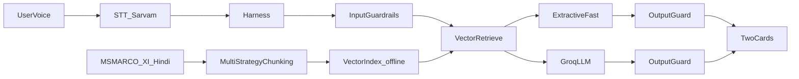

# Master Plan: Voice-Enabled RAG (HH Goa 2026 Task 2)

This is the **from-zero guide** for the whole project. The product is now in **final phase** (pipeline + local UI done; ship remaining).

**Source of truth:** [project_requirement/task_2_hhg.md](../project_requirement/task_2_hhg.md)

**Team split:** [team_plan.md](team_plan.md)

**Today:** 18 August 2026 (final phase)  
**Deadline:** 22 August 2026, 11:59 PM  
**Time left:** about 4 days. Submit once. No resubmission.

---

## 1. What this project is (plain language)

A user **speaks** a question into a microphone. Our system:

1. Converts that voice into text (Speech-to-Text).
2. Finds the most relevant passages from a given dataset (retrieval).
3. Writes **two** answers that are **grounded in those passages**: a fast extractive snippet, and an LLM rewrite.
4. Returns both to the user, with split timings.

That pattern is called **RAG** — Retrieval-Augmented Generation. The model does not answer from memory alone. It first looks up context, then answers from that context.

The brief’s pipeline:

```
Voice input → Speech-to-text → Chunking / Retrieval (vector DB) → Answer generation
```

**Dataset we must use:** [ai4bharat/MSMARCO-XI](https://huggingface.co/datasets/ai4bharat/MSMARCO-XI) on Hugging Face.

By the end we also need:

- A GitHub repo
- A **live working URL**
- Two videos (process + demo)
- Every teammate posting both videos on Instagram, X, and LinkedIn with `#RAGInGoa`
- One filled [submission form](https://forms.gle/MNvCjcv23Hn2Eeu58)

---

## 2. Hard rules from the brief (must not miss)

These are not optional. If any of these is missing, the submission is incomplete.

| Rule | What it means |
|---|---|
| **STT vendor** | Use **Sarvam or ElevenLabs** for voice-to-text. Pick one. No other STT vendor. |
| **Chunking** | Do **not** submit a single naive fixed-size split. Show real thought: multiple strategies, overlap, semantic vs fixed-size, metadata-aware chunking. |
| **Latency** | The query path should finish in **under 200ms**. |
| **Latency analytics** | Report **P50 / P70 / P100** over a reasonable number of test queries — not one lucky run. |
| **Harness** | Wrap the model in structured orchestration: tool calls, retries, structured input/output, error recovery. Not a single raw prompt-in, text-out call. |
| **Guardrails** | Handle off-topic queries, unsafe/inappropriate inputs, and answers not grounded in retrieved context. The system must know **when not to answer**. |
| **Submit once** | GitHub + live URL + 2 videos + form. No resubmission. Submit only when final. |
| **Promo** | Every individual team member posts both videos on Instagram, X, and LinkedIn. At least one Instagram account must be public. Every post must include `#RAGInGoa`. |
| **Deadline** | 22 August 2026, 11:59 PM. |

### Latency interpretation (locked)

**200ms for Speech-to-Text + retrieve + LLM together is not realistic.** STT and Groq are network calls.

Locked for submission:

- **Chunking and indexing happen offline.** Not on the 200ms clock.
- **`latency_ms` (200ms target)** = retrieve + **extractive** answer + harness/guardrail overhead after a transcript exists.
- **`stt_ms`** = Sarvam, reported separately.
- **`generate_ms`** = Groq LLM card, reported separately. The HTTP request waits for Groq so both UI cards return together; that wait is **not** `latency_ms`.
- Query-time retrieve is warmed up at process start (MiniLM + FAISS). Torch/FAISS thread caps and lexical stopwords keep the extractive path under 200ms after startup.
- Local bench **18 Aug 2026** (`app/latency_bench.py`, 15 Hindi sample queries, warmed process): extractive `latency_ms` **P50=93 / P70=100 / P100=169**. HTTP end-to-end P50 ~886ms because Groq is included in HTTP, not in `latency_ms`. Re-measure on Render.

---

## 3. Architecture (high level only)

Two timelines exist. Do not mix them.

1. **Offline (once):** download dataset → chunk with several strategies → embed → build vector index.
2. **Online (every question):** voice → text → input guardrails → retrieve → **extractive + Groq LLM** (same chunks) → output guardrails each → two answers.



### Frozen stack

- **Language:** one FastAPI app (`project2/.venv`, Python 3.13; recreated 18 Aug)
- **UI:** HTML + vanilla JS + Tailwind in `app/static/` — **not React, not Vue, not Vercel**
- **Local run:** `uvicorn app.main:app --host 0.0.0.0 --port 8000` → `http://127.0.0.1:8000`
- **Data:** MSMARCO-XI Hindi `hinval.parquet`, first **5000** validation rows (HF has no `hi` config)
- **Vector store:** FAISS in `indexes/` (~289k chunks, MiniLM 384-d, `IndexFlatIP`)
- **Generation:** extractive primary (200ms) + Groq `openai/gpt-oss-20b` explicit card
- **Sample questions:** `GET /sample-question` + `GET /api/sample-questions` — MSMARCO queries whose selected Hindi passages exist in `indexes/chunks.json`
- **Deploy:** **one Render Web Service** — same URL for page and `/ask` (**not live yet**)

---

## 3b. Repo structure (no separate frontend host)

```
project2/
  one-time/download_dataset/
  one-time/create_vector_database/
  indexes/                 # index.faiss + chunks.json + sample_queries.json
  app/                     # Python server + harness
  app/static/              # mic UI + sample-question page (HTML/JS)
  team_plan.md
  project_plan.md
project_requirement/       # brief (repo root)
research_and_study/
```

Render runs `app/`. It must **not** download the 55.6 GB Hugging Face dump at boot.

---

## 3c. Python packages (`project2/.venv`)

A virtualenv lives at `project2/.venv` (gitignored). Recreated 18 Aug 2026 (Python 3.13.7) and installed from `project2/requirements.txt` (same pins as `app/requirements.txt`).

| Package | Why |
|---|---|
| `datasets` | Load / slice MSMARCO-XI Hindi parquet in `download.py` |
| `pyarrow` | Fast parquet backend for `datasets` |
| `sentence-transformers` | Text → embedding vectors (`all-MiniLM-L6-v2`) |
| `faiss-cpu` | `index.faiss` + nearest-neighbour search |
| `numpy` | Float arrays for embeddings |
| `fastapi` + `uvicorn` | HTTP app + static UI |
| `httpx` | Sarvam + Groq |
| `python-dotenv` | `.env` keys |

Pip also pulled **dependencies**: `torch`, `transformers`, `tokenizers`, `huggingface-hub`, plus `pandas`, `tqdm`, `requests`, `scipy`, `scikit-learn`, and others.

Activate:

```powershell
cd project2
.\.venv\Scripts\Activate.ps1
```

---

## 4. Phase map

| Phase | Name | Status |
|---|---|---|
| 0 | Understand + freeze decisions | **Done** — Sarvam, Groq, FAISS, Render, no React, 200ms = extractive |
| 1 | Environment from zero | **Done** — `.venv` recreated 18 Aug (Python 3.13.7), `.env`, git |
| 2 | Dataset + multi-strategy chunking | **Done** — `hinval` 5000 rows; passage_full / fixed_overlap / sentence_group |
| 3 | Vector index | **Done** — `indexes/` 289,561 chunks |
| 4 | Retrieval + generation | **Done** — FAISS + lexical (stopwords); extractive + Groq cards; encoder/FAISS warmup at boot |
| 5 | Harness | **Done** — structured steps, retries, JSON |
| 6 | Guardrails | **Done** — input / off-topic / output grounding |
| 7 | Speech-to-text | **Done locally** — Sarvam on `POST /ask` |
| 8 | Latency + P50 / P70 / P100 | **Done locally** — extractive P100=169ms (under 200ms). Re-run on Render |
| 9 | UI + live deploy | Local UI **done** (`/`, `/sample-question`); **Render still open** |
| 10 | Videos + social + submit | **Open** — 22 Aug morning |

Do not reopen 0–8 unless Render OOM forces a smaller index. Remaining work is phase 9 deploy + phase 10 ship.

---

## 5. Remaining days

| When | Focus |
|---|---|
| **19–20 Aug** | Render Web Service, env vars, phone test, re-bench on host |
| **21 Aug** | Live URL freeze, dry-run demo, hotfix only |
| **22 Aug morning** | Videos, `#RAGInGoa` posts, **one** form submit |

If something slips, protect: **working live demo → latency numbers → videos → extra chunking polish**.

---

## 6. From-zero sequence (what we actually did)

1. Read the brief — [project_requirement/task_2_hhg.md](../project_requirement/task_2_hhg.md).
2. Froze stack: FastAPI + HTML, Sarvam, Groq, FAISS, Render, no React.
3. Downloaded MSMARCO-XI Hindi parquet (`hinval`), 5000 rows — Hub has no `hi` config.
4. Three chunk strategies + MiniLM + FAISS offline.
5. Retrieval (FAISS + lexical) + extractive answer for 200ms. Boot warmup + thread caps so the first user click is not a 2s PyTorch cold start.
6. Groq LLM as an **explicit second card**, same chunks, own guard.
7. Harness + input/output guardrails.
8. Sarvam on `POST /ask`; text bench on `/ask-text`.
9. Sample questions page: `GET /sample-question` from `chunks.json` selected Hindi `query_id`s.
10. Measured P50/P70/P100 on extractive `latency_ms` (P100=169ms, under 200ms).
11. **Next:** Render live URL, phone test, two videos, social, one form.

---

## 7. Out of scope for this file

This master plan does **not** include application code or API dumps. Runtime detail lives in [app/README.md](app/README.md) and [research_and_study/study.md](../research_and_study/study.md).

---

## 8. Decisions (were open questions — now frozen)

1. **STT:** Sarvam (not ElevenLabs).
2. **Index subset:** Hindi validation 5000 rows (~289k chunks). Shrink with `--max-rows` if Render OOM.
3. **LLM:** Groq `openai/gpt-oss-20b`. 200ms path is extractive, not Groq.
4. **Under 200ms:** retrieve + extractive + guards after transcript. STT and Groq reported separately. Locked locally: warmup at startup, 4 torch/FAISS threads, skip lexical stopwords. UI chip `extractive` is `latency_ms`; `retrieve` is shown separately.
5. **TTS:** no. Brief does not require speaking the answer back.
6. **Team:** 3 people (A / B / C). See [team_plan.md](team_plan.md).
7. **Live URL:** Render Web Service (CPU). No React/Vercel. Deploy still open.
8. **Demo language:** Hindi + English (index has both passage languages). UI copy is English-first.

---

## 9. How we will use this file

- This file is the **map**. [team_plan.md](team_plan.md) is **who ships the remaining days**.
- If anything disagrees with the brief, the brief wins.
- Do not reopen frozen stack unless Render forces a smaller index.
